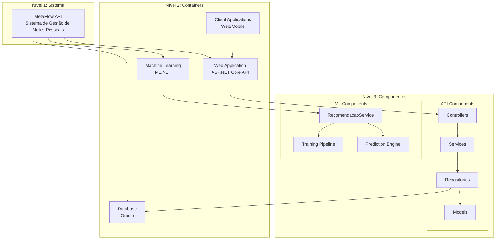
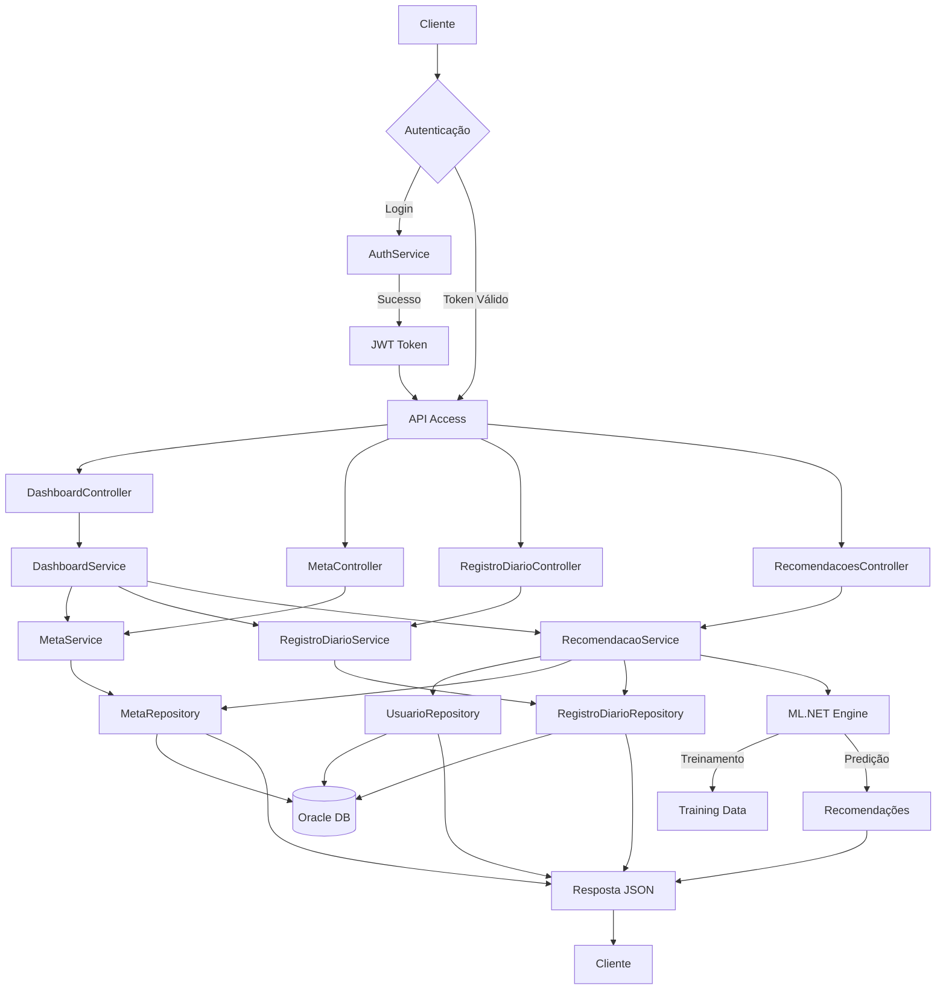
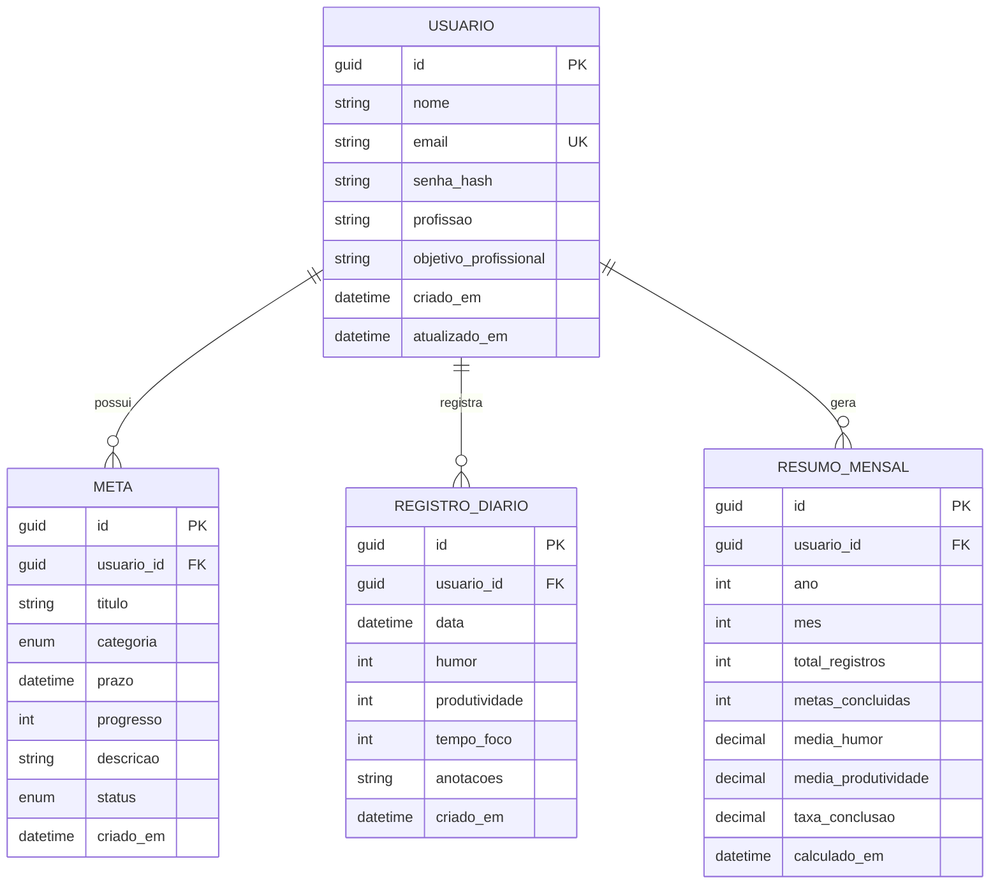

# MetaFlow - Plataforma de Desenvolvimento Pessoal e Profissional Inteligente


## Índice

- [Visão Geral](#visão-geral)
- [Arquitetura do Sistema](#arquitetura-do-sistema)
- [Tecnologias Utilizadas](#tecnologias-utilizadas)
- [Estrutura do Projeto](#estrutura-do-projeto)
- [Configuração e Execução](#configuração-e-execução)
- [Execução de Testes](#execução-de-testes)
- [Documentação da API](#documentação-da-api)
- [Autenticação e Autorização](#autenticação-e-autorização)
- [Versionamento da API](#versionamento-da-api)
- [Health Checks e Monitoramento](#health-checks-e-monitoramento)
- [Machine Learning (ML.NET)](#machine-learning-mlnet)
- [Exemplos de Uso](#exemplos-de-uso)
- [Exemplos Completos de Requisições](#exemplos-completos-de-requisições)
- [Licença](#licença)


Arquitetura do Sistema
----------------------

### Diagrama de Arquitetura C4 - Nível de Componentes




### Explicação da Arquitetura
A visão macro do sistema em 3 níveis de abstração

Estrutura:

Nível 1 - Sistema: MetaFlow API como um todo

Nível 2 - Containers: Componentes principais (API Web, Banco de Dados, ML, Clientes)

Nível 3 - Componentes: Partes internas da aplicação (Controllers, Services, Repositories, Models)

Significado: Demonstra como o sistema é organizado em camadas independentes, seguindo os princípios de Clean Architecture.


### Diagrama de Fluxo de Dados



### Explicação do diagrama de Fluxo de dados 


 Como as informações circulam pelo sistema durante uma requisição típica

Fluxo principal:

Cliente → Autenticação JWT

Controllers → Recebem requests HTTP

Services → Executam lógica de negócio

Repositories → Acessam banco de dados

ML.NET → Processa recomendações inteligentes

Resposta → Retorna dados formatados ao cliente

Significado: Explica o caminho completo de uma requisição, desde o cliente até o processamento do machine learning e volta.

### Modelo de Dados:



### Explicação Modelo de Dados (Diagrama ER)

As entidades principais do sistema e seus relacionamentos

Entidades principais:

USUARIO → Dados do usuário e perfil

META → Metas pessoais/profissionais com categorias

REGISTRO_DIARIO → Check-ins de humor e produtividade

RESUMO_MENSAL → Agregados mensais para analytics

Relacionamentos:

Um usuário pode ter múltiplas metas, registros e resumos

Todas as entidades se conectam através do usuário_id

Significado: Define a estrutura do banco de dados e como as informações são relacionadas.

Visão Geral
-----------
 O Desafio FIAP: Preparando para o Futuro do Trabalho
No cenário atual de transformação digital acelerada, onde tecnologia e relações humanas se entrelaçam, identificamos uma necessidade crítica: as pessoas estão sobrecarregadas com múltiplas metas pessoais e profissionais, mas carecem de um sistema inteligente que as ajude a gerir seu desenvolvimento de forma holística e sustentável.

 A Solução MetaFlow
O MetaFlow é uma plataforma inovadora que combina gestão de metas tradicionais com machine learning para criar um parceiro digital inteligente no desenvolvimento pessoal e profissional. Não é apenas mais um app de produtividade - é um ecossistema de crescimento contínuo que se adapta ao usuário.

 Por Que Isso Importa?
 O Paradoxo da Produtividade Moderna
Excesso de ferramentas, mas falta de insights reais

Metas desconexas entre vida pessoal e profissional

Sobrecarga de informações sem direção clara

Falta de personalização nas recomendações de desenvolvimento

 Contexto do Futuro do Trabalho
47% dos profissionais relatam burnout por má gestão de metas (Fonte: WHO)

65% das crianças atuais trabalharão em profissões que ainda não existem (Fonte: WEF)

Híbrido/Remoto exigem nova forma de auto-gerenciamento

IA como parceira, não substituta, do potencial humano

 Conceito da Solução
 Parceiro de Desenvolvimento Pessoal Inteligente
O MetaFlow atua como um "personal trainer" digital para seu crescimento, utilizando:

```text
 Análise Comportamental +  Machine Learning +  Metas Personalizadas =  Crescimento Sustentável
 ``` 
 Pilares da Plataforma:
1. Gestão Holística de Metas
7 categorias integradas: Carreira, Saúde, Pessoal, Educação, Financeiro, Relacionamentos, Lazer

Progresso visual com métricas tangíveis

Alertas inteligentes de prazos e consistência

2. Check-in Emocional e Produtivo
Registro diário de humor e produtividade

Análise de padrões comportamentais

Correlação automática entre bem-estar e performance

3. Sistema de Recomendações com ML.NET
Análise preditiva baseada em seus dados

Sugestões personalizadas de próximas metas

Fallback inteligente quando dados são insuficientes

4. Dashboard de Insights Visuais
Visão 360° do desenvolvimento

Tendências e progresso ao longo do tempo

Alertas proativos baseados em comportamento

 Inovação e Diferenciais
 Resposta ao Desafio FIAP:
 Novas Formas de Aprendizagem
Learning path personalizado baseado em metas

Micro-checkins que geram macro-insights

Adaptação contínua ao ritmo do usuário

 Saúde e Bem-estar no Trabalho
Monitoramento integrado de produtividade e humor

Alertas preventivos de burnout

Correlação dados entre bem-estar e performance

 IA como Parceira do Ser Humano
ML.NET para recomendações personalizadas

Análise de padrões comportamentais

Sugestões contextualizadas sem substituir decisão humana

 Preparação para Carreiras Futuras
Desenvolvimento de soft skills mensurável

Adaptabilidade através de metas flexíveis

Auto-conhecimento como base para qualquer carreira

 Ambientes Híbridos e Remotos
Auto-gerenciamento eficiente

Métricas objetivas de produtividade

Equilíbrio vida-trabalho mensurável

 Impacto e Benefícios
 Para Indivíduos:
Clareza no desenvolvimento pessoal e profissional

Motivação sustentável através de progresso visível

Autoconhecimento baseado em dados reais

Prevenção de burnout com alertas proativos

 Para Organizações:
Funcionários mais engajados e conscientes

Desenvolvimento contínuo mensurável

Cultura de feedback e crescimento

Adaptabilidade para mudanças futuras

 Para Sociedade:
Profissionais mais preparados para o futuro

Equilíbrio entre vida pessoal e profissional

Inclusão através de ferramentas acessíveis

Sustentabilidade no desenvolvimento de carreiras

 Como Responde ao Desafio
 "Preparar jovens para carreiras que ainda não existem"
Desenvolvendo adaptabilidade através do gerenciamento de metas flexíveis

Fortalecendo auto-conhecimento - base para qualquer carreira futura

Criando mentalidade de crescimento contínuo

 "Reinventar ambientes de trabalho"
Ferramentas para auto-gerenciamento em modelos híbridos/remotos

Métricas de bem-estar integradas à produtividade

Sistema de apoio para transições de carreira

 "Bem-estar, inclusão e desenvolvimento contínuo"
Abordagem holística que considera todas as áreas da vida

Acessível através de interface intuitiva

Adaptável a diferentes ritmos e necessidades

 Conclusão da Visão
O MetaFlow não é apenas um software - é uma nova abordagem para o desenvolvimento humano na era digital. Combinando a precisão dos dados com a sabedoria do autoconhecimento, criamos uma plataforma que prepara pessoas não apenas para o mercado de trabalho atual, mas para se tornarem protagonistas de suas próprias jornadas de vida.


#### Padrões de Design Implementados
